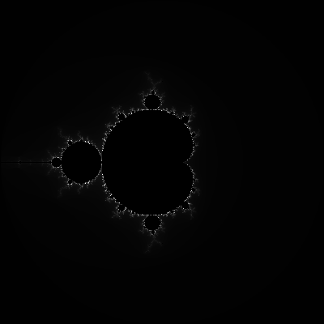
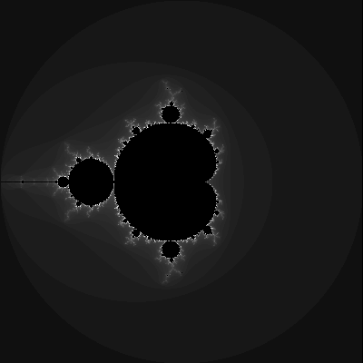

# MandelbrotSet

Generate Mandelbrot set images.

|         Default         |       Pretty Grey scale        |
| :---------------------: | :----------------------------: |
|  |  |

## Static MPI Assignment

|        4 process         |        10 process         |
| :----------------------: | :-----------------------: |
|  |  |

## Dynamic MPI Assignment

|   10 process, Dynamic   |
| :---------------------: |
|  |

# Performance

|            | # of workers | 1        | 2        | 3        | 4        | 5        | 6        | 7        | 8        | 9        | 10       | average   |
| ---------- | ------------ | -------- | -------- | -------- | -------- | -------- | -------- | -------- | -------- | -------- | -------- | --------- |
| sequential | 1            | 0.045418 | 0.049514 | 0.047107 | 0.046766 | 0.048218 | 0.049928 | 0.048952 | 0.04762  | 0.04946  | 0.045668 | 0.0478651 |
| dynamic    | 1            | 0.036542 | 0.036679 | 0.037071 | 0.036841 | 0.036673 | 0.036707 | 0.036913 | 0.036895 | 0.036867 | 0.036599 | 0.0367787 |
|            | 2            | 0.01933  | 0.01862  | 0.018908 | 0.01891  | 0.018569 | 0.018977 | 0.018598 | 0.018773 | 0.018687 | 0.018653 | 0.0188025 |
|            | 4            | 0.009543 | 0.009486 | 0.009466 | 0.009684 | 0.009481 | 0.009563 | 0.009679 | 0.009513 | 0.009565 | 0.009733 | 0.0095713 |
|            | 8            | 0.005442 | 0.005459 | 0.005217 | 0.005179 | 0.005141 | 0.005279 | 0.005294 | 0.005173 | 0.005849 | 0.005412 | 0.0053445 |
| static     | 1            | 0.042841 | 0.043301 | 0.042708 | 0.042672 | 0.043121 | 0.042973 | 0.042679 | 0.04303  | 0.043105 | 0.042997 | 0.0429427 |
|            | 2            | 0.024983 | 0.025252 | 0.024555 | 0.024591 | 0.02485  | 0.024939 | 0.026033 | 0.025262 | 0.02588  | 0.024668 | 0.0251013 |
|            | 4            | 0.021891 | 0.022232 | 0.022719 | 0.021981 | 0.021867 | 0.022246 | 0.021933 | 0.021877 | 0.022648 | 0.02201  | 0.0221404 |
|            | 8            | 0.020004 | 0.017621 | 0.018836 | 0.017474 | 0.01721  | 0.017389 | 0.017461 | 0.017401 | 0.018887 | 0.017513 | 0.0179796 |

Time(Seconds) to generate image, not including time spent saving image.